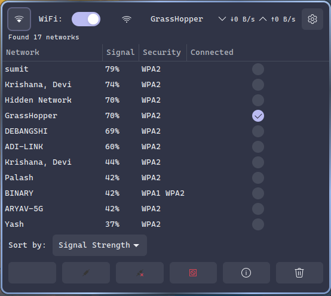
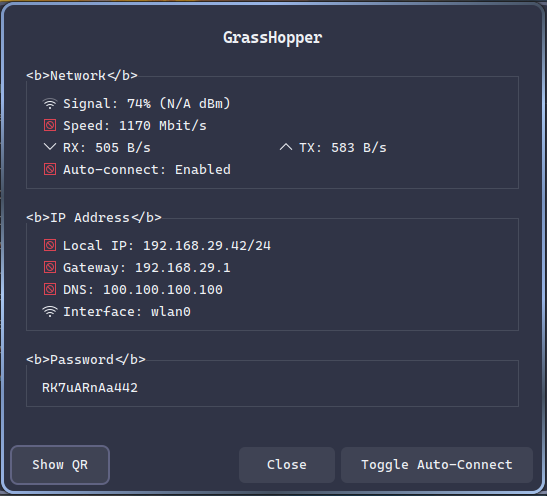
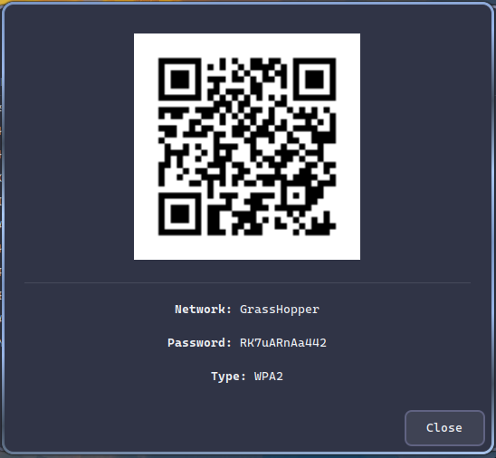
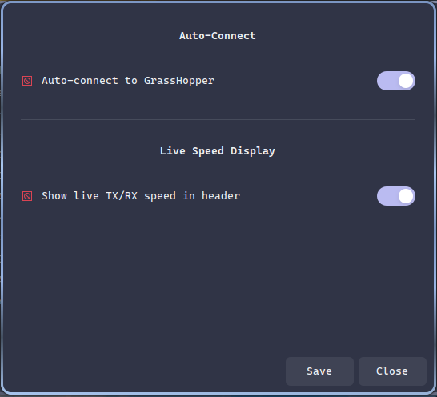

# WiFi GTK Manager

A native GTK3 WiFi manager with full NetworkManager integration, QR code support, and live speed monitoring.



## Features

- **Scan & Connect** - List available WiFi networks with signal strength
- **Live Speed Monitoring** - Real-time TX/RX speed display in header
- **WiFi Toggle** - Turn WiFi on/off directly from the app
- **QR Code Generation** - Share WiFi with smartphone camera scan
- **Connection Details** - View IP, Gateway, DNS, Signal dBm
- **Auto-Connect Toggle** - Enable/disable auto-connect for networks
- **Forget Networks** - Remove saved network profiles
- **Sort Networks** - By Signal Strength, Name, or Security
- **Hotspot Creation** - Native NetworkManager hotspot support
- **Persistent Settings** - Preferences saved between sessions
- **Custom Icons** - Bundled SVG icons for consistent look
- **Refresh Networks** - Scan for available WiFi networks on demand

## Installation

### Ubuntu/Debian

```bash
sudo apt install network-manager nmcli qrencode python3-gi python3-gi-cairo gir1.2-gtk-3.0
```

### Arch Linux

```bash
sudo pacman -S networkmanager nmcli qrencode python-gobject gtk3
```

### Setup

```bash
cd /path/to/nm-applet/wifi-gtk
chmod +x wifi-manager.py
```

## Usage

```bash
python3 wifi-manager.py
```

## Icons

The application uses bundled SVG icons for consistent appearance:

| Icon       | File                                       | Used For          |
| ---------- | ------------------------------------------ | ----------------- |
| Hotspot    | `hotspot-rectangles-symbolic.svg`          | Hotspot button    |
| QR Code    | `qr-code-scanner-symbolic.svg`             | QR code button    |
| Connect    | `plug-symbolic.svg`                        | Connect button    |
| Disconnect | `unplug-dots-symbolic.svg`                 | Disconnect button |
| Refresh    | `arrow-circular-bottom-right-symbolic.svg` | Refresh button    |

Add more SVG icons to the `icons/` directory and update `SVG_ICON_MAP` in `dialogs.py`.

## Screenshots

### Connection Info Dialog



### QR Code Feature



Generate QR codes for easy smartphone connection. Format:

```
WIFI:T:WPA2;S:NetworkName;P:Password;;
```

### Settings Dialog



Settings are saved to `~/.config/wifi-manager/settings.conf`

## Features Overview

### Header Bar Features

| Element        | Description                                |
| -------------- | ------------------------------------------ |
| Hotspot Button | Opens dedicated hotspot configuration page |
| WiFi Toggle    | Switch to enable/disable WiFi radio        |
| Live Speed     | Real-time download/upload speeds           |
| Current SSID   | Shows connected network name               |
| Settings       | Opens preferences dialog                   |

### View detailed information:

- Network name (SSID)
- Signal strength (%, dBm)
- Connection speed
- IP address, Gateway, DNS servers
- Auto-connect status

## Project Structure

```
wifi-gtk/
├── wifi-manager.py              # Main GTK3 application
├── wifi_manager/                 # Python package
│   ├── __init__.py            # Package init
│   ├── wifi_manager.py         # Main window
│   ├── nmcli_utils.py          # nmcli wrappers
│   ├── qr_utils.py             # QR code utilities
│   ├── dialogs.py             # GTK dialogs
│   ├── hotspot_utils.py        # Hotspot utilities
│   └── hotspot_dialog.py       # Hotspot page
├── icons/                        # Bundled SVG icons
│   ├── hotspot-rectangles-symbolic.svg
│   ├── qr-code-scanner-symbolic.svg
│   ├── plug-symbolic.svg
│   ├── unplug-dots-symbolic.svg
│   └── arrow-circular-bottom-right-symbolic.svg
├── assets/                      # Screenshots
│   ├── homepage.png
│   ├── info.png
│   ├── QR.png
│   └── settings.png
├── wifi-manager.sh              # YAD version
├── wifi-manager-zenity.sh       # Zenity version
└── README.md
```

## Requirements

| Component      | Ubuntu/Debian   | Arch Linux     |
| -------------- | --------------- | -------------- |
| Python         | python3         | python         |
| GObject        | python3-gi      | python-gobject |
| GTK            | gir1.2-gtk-3.0  | gtk3           |
| nmcli          | nmcli           | nmcli          |
| NetworkManager | network-manager | networkmanager |
| QR Code        | qrencode        | qrencode       |
